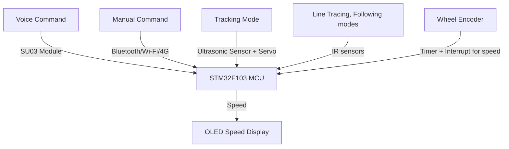

# 🚗 Audio-Enabled Smart Car System

An **audio-enabled smart car** built with the **STM32F103 microcontroller**, supporting multiple driving modes such as obstacle avoidance, line tracing, object following, and manual control. The car integrates voice recognition, wireless communication, and real-time feedback to demonstrate the fundamental principles behind autonomous vehicles.

---

## ✨ Features

- **4 Driving Modes**
  - **Obstacle Avoidance** – Uses an ultrasonic sensor on a servo motor to detect obstacles and choose a safe path.
  - **Line Tracing** – Follows a black line track using IR sensors.
  - **Object Following** – Tracks and follows a moving object in front.
  - **Manual Control** – Controlled via voice, Bluetooth (HC08), Wi-Fi (ESP8266), or 4G module.

- **Voice Control (SU03 Module)**
  - Switch between modes by saying commands like `"manual"` or `"tracing"`.

- **Wireless Control**
  - Supports **Bluetooth, Wi-Fi (TCP/IP via ESP8266), and 4G** for remote operation.

- **Real-Time Speed Measurement**
  - Uses **timers + interrupts** to measure wheel rotations per second.
  - Displays speed on an **OLED screen**.

- **Full Embedded Implementation**
  - All logic written in **Embedded C** on STM32.
  - Sensor integration, real-time task handling, and wireless communication.

---

## 🛠️ Hardware Components

- **STM32F103C8T6 ("Blue Pill")**
- **SU03 Voice Recognition Module**
- **ESP8266 Wi-Fi Module**
- **HC08 Bluetooth**
- **Ultrasonic Sensor + SG90 Servo Motor**
- **IR Line Sensors**
- **DC Motors with Wheels + Motor Driver**
- **OLED Display**
- **Car Chassis**

---

## 🏗️ System Architecture

